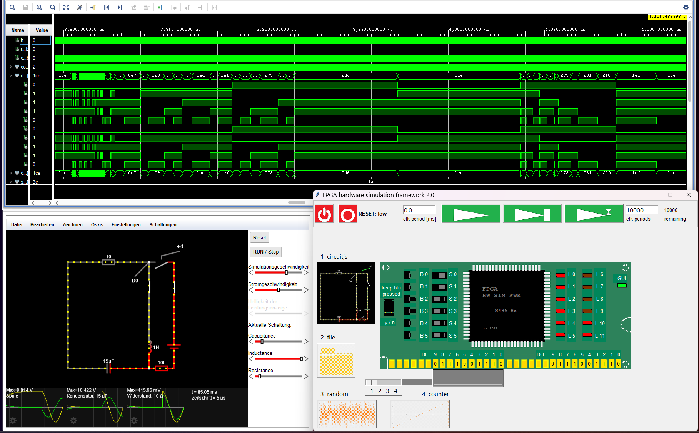
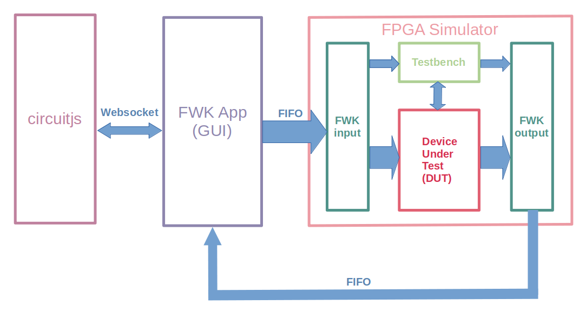
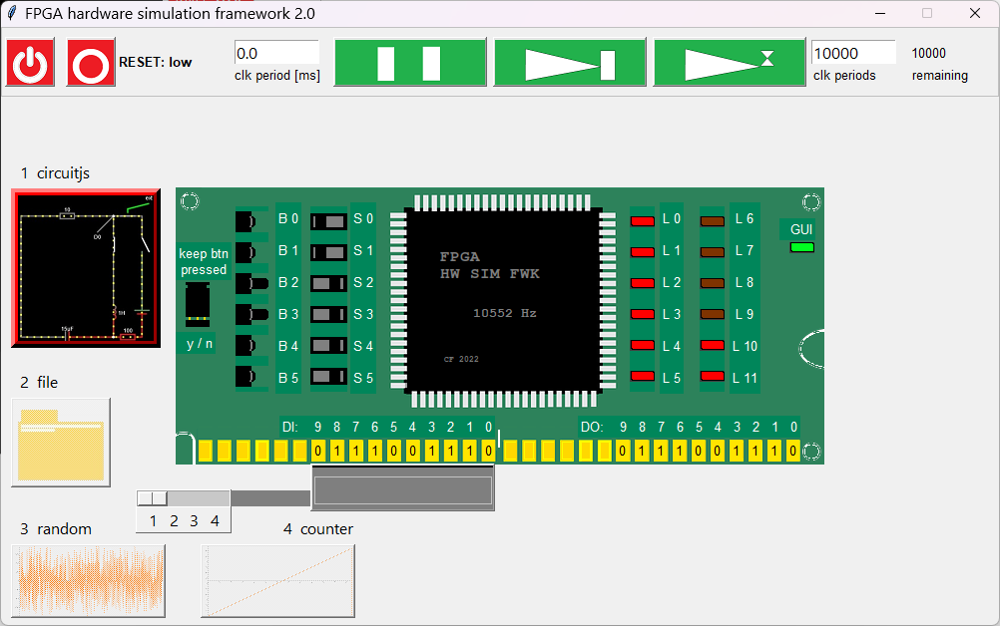

# FPGA_HW_SIM_FWK_2  (includes generation of .exe file!)
FPGA Hardware Simulation Framework 2.0

["Old" article in Code Project](https://www.codeproject.com/Articles/5329919/FPGA-Hardware-Simulation-Framework-FPGA-HW-SIM-FWK "FPGA_HW_SIM_FWK Article in Code Project")

["Old" project in GitHub](https://github.com/ClarkFieseln/FPGA_HW_SIM_FWK)

## Simulate hardware containing an FPGA programmed in VHDL interactively!

## Architecture overview

## FPGA GUI

## FPGA_HW_SIM_FWK (demo video)

["Old" demo video](https://www.youtube.com/watch?v=Yqu1DDGK04c "FPGA_HW_SIM_FWK Demo Video")

## Dependencies
To install dependencies go to python\hw_sim_fwk_2 and type:

  > pip_install_requirements.bat
  
To install the designer tool type:

  > pip install pygubu-designer
  
## Executable file (approx. 9MB, all included!)
To generate and run an executable file go to python\hw_sim_fwk_2 and type:

  > gen_and_run_exe.bat

This only takes a few seconds to complete.

## Summary
This tool provides the following features, usually not supported by standard simulation methods:
  - GUI
  - concurrent input / output (up to 40kHz!)
  - interactive experience with emulated HW
  - communication interface between App and VHDL-Simulator based on named pipes (FIFOs)
  
The stimulus and results exchanged between the Simulation App written in Python and the
VHDL Simulation Tool (any tool supporting VHDL 2008) are fast enough to produce a realistic and interactive HW behavior.

The current project is an improvement of an earlier project which has been optimized for performance,
achieving simulation rates of up to 40kHz!

In order to support simulation of "asynchronous" signals, the current rate of the simulation clock is reduced to approx. 10kHz. But the overall simulation rate continues to be 40kHz because signals are exchanged in 4 different clock phases within each clock period.
  
